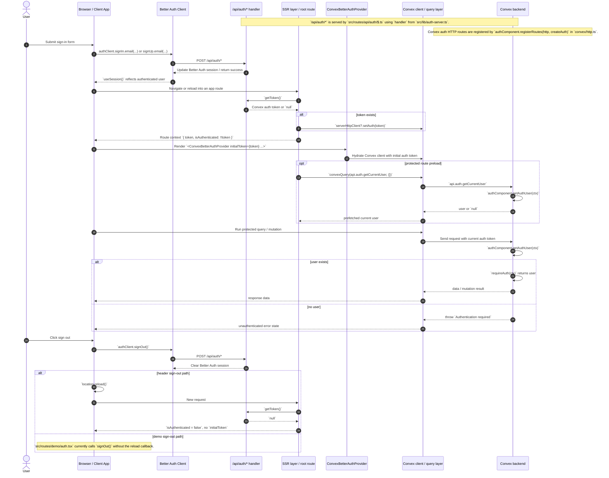

# Authentication flow

This document describes the current Better Auth + Convex authentication flow implemented in this repository. It is intended for contributors who need to understand how auth state moves between the browser, SSR, the Convex client, and Convex backend functions.

## Sequence diagram

## Auth architecture

The auth implementation is split across three layers:

1. **Better Auth client and route handler** manage browser-facing sign-in, sign-up, sign-out, and session state.
2. **SSR and provider wiring** retrieve a Convex-compatible token and inject it into the Convex client during server rendering and hydration.
3. **Convex backend functions** resolve the current user from the auth context and enforce authorization inside queries and mutations.

The important design choice is that frontend route protection and Convex backend authorization are separate concerns. Route guards improve UX, but backend functions still enforce auth themselves.

## Main files and responsibilities

### Browser auth client

- `src/lib/auth-client.ts`
  - Creates `authClient` with `createAuthClient({ plugins: [convexClient()] })`.
  - `convexClient()` is the key plugin that makes Better Auth cooperate with Convex auth token handling.

### App auth route handler and server helpers

- `src/lib/auth-server.ts`
  - Creates `handler`, `getToken`, `fetchAuthQuery`, `fetchAuthMutation`, and `fetchAuthAction` via `convexBetterAuthReactStart(...)`.
  - `handler` is mounted at the app's `/api/auth/*` route.
  - `getToken()` is used during SSR to derive auth state for the current request.
- `src/routes/api/auth/$.ts`
  - Exposes `handler(request)` for `GET` and `POST` requests under `/api/auth/*`.

### SSR and provider wiring

- `src/routes/__root.tsx`
  - Calls `getToken()` in the root route `beforeLoad`.
  - If a token exists, calls `ctx.context.convexQueryClient.serverHttpClient?.setAuth(token)`.
  - Derives `isAuthenticated` as `!!token` and returns both `token` and `isAuthenticated` in route context.
  - Passes `token` into `<ConvexProvider initialToken={context.token}>`.
- `src/integrations/convex/provider.tsx`
  - Creates `ConvexQueryClient(CONVEX_URL, { expectAuth: true })`.
  - Wraps the app in `<ConvexBetterAuthProvider client={...} authClient={authClient} initialToken={initialToken}>`.
  - This is where the Better Auth session and Convex client state are connected on the client.

### Convex auth setup

- `convex/auth.config.ts`
  - Supplies `getAuthConfigProvider()` as the auth provider config required by the Convex Better Auth integration.
- `convex/convex.config.ts`
  - Registers the Better Auth Convex component with `app.use(betterAuth)`.
- `convex/http.ts`
  - Registers Better Auth HTTP routes inside Convex using `authComponent.registerRoutes(http, createAuth)`.
  - This is required so the Better Auth integration can talk to Convex.
- `convex/auth.ts`
  - Creates `authComponent` via `createClient<DataModel>(components.betterAuth)`.
  - Builds the Better Auth server instance in `createAuth(ctx)` using `authComponent.adapter(ctx)` and the Convex plugin.
  - Exposes `getCurrentUser`, which returns `authComponent.getAuthUser(ctx)`.

### Protected Convex functions and protected routes

- `convex/todos.ts`
  - Defines `requireAuth(ctx)` using `authComponent.getAuthUser(ctx)`.
  - Calls `await requireAuth(ctx)` at the top of each protected query/mutation.
- `src/routes/_authed/route.tsx`
  - Redirects when `context.isAuthenticated` is false.
  - Prefetches `api.auth.getCurrentUser` via `convexQuery(...)`.
- `src/routes/login.tsx`
  - Uses `authClient.signIn.email(...)`, `authClient.signUp.email(...)`, and `authClient.useSession()`.
- `src/components/AuthButton.tsx`
  - Uses `authClient.useSession()` for UI state.
  - Signs out and then reloads the page to fully reset auth state.

## Request lifecycle

### 1. Sign-in and sign-up flow

Current implementation:

1. The login page calls `authClient.signIn.email(...)` or `authClient.signUp.email(...)` in `src/routes/login.tsx`.
2. `authClient` is the Better Auth React client configured with `convexClient()`.
3. Those requests go through `/api/auth/*`, which is backed by `handler` from `src/lib/auth-server.ts`.
4. Better Auth updates the session state, and `authClient.useSession()` begins returning the authenticated user.
5. The login page currently navigates to `/app` on success.
6. On the next SSR request or reload, the root route calls `getToken()` and derives `isAuthenticated` from whether a token exists.
7. That token is injected into the server-side Convex client and passed to the browser as `initialToken`.

### 2. SSR token synchronization flow

This is the part that keeps route-level SSR auth and the Convex client aligned:

1. `src/routes/__root.tsx` calls `getToken()` during `beforeLoad`.
2. If a token is returned, `serverHttpClient?.setAuth(token)` is called on the `ConvexQueryClient`.
3. The root route returns:
   - `token`
   - `isAuthenticated: !!token`
4. `RootComponent` passes `token` into `<ConvexProvider initialToken={context.token}>`.
5. `src/integrations/convex/provider.tsx` passes that token to `<ConvexBetterAuthProvider ... initialToken={initialToken}>`.
6. The provider uses that initial token to hydrate the browser-side Convex client consistently with SSR.

### 3. Protected route flow

Protected routes rely on the SSR-derived route context:

- `src/routes/_authed/route.tsx` checks `context.isAuthenticated` in `beforeLoad`.
- If false, it redirects to `/login`.
- In `loader`, it prefetches `api.auth.getCurrentUser` via `convexQuery(api.auth.getCurrentUser, {})`.

This improves navigation behavior, but it is not the final authorization boundary. Convex backend functions must still enforce auth.

### 4. Runtime authorization inside Convex

The current backend authorization pattern is explicit and local to each function:

- `convex/auth.ts#getCurrentUser`
  - Returns the current authenticated user with `authComponent.getAuthUser(ctx)`.
  - It does **not** throw if no user exists; it returns `null`.
- `convex/todos.ts#requireAuth`
  - Calls `authComponent.getAuthUser(ctx)`.
  - Throws `new Error('Authentication required')` when no user is present.
  - Returns the user otherwise.

Protected queries/mutations call `await requireAuth(ctx)` before touching application data. Example current usage:

- `list`
- `add`
- `toggle`
- `remove`

All of those live in `convex/todos.ts`.

## How to protect new Convex queries and mutations

When adding a new protected Convex function:

1. Import `authComponent` or reuse an existing helper such as `requireAuth(ctx)`.
2. Resolve the current user with `authComponent.getAuthUser(ctx)`.
3. Throw when the user is absent.
4. Only then read or write protected data.

Recommended pattern based on the current code:

- Keep a shared helper like `requireAuth(ctx)` near the protected functions or extract one to a dedicated module if multiple files need it.
- Treat route guards as convenience only; always enforce auth on the backend too.

`getCurrentUser` is useful for UI bootstrapping and loaders, but it should not be treated as a substitute for authorization inside data mutations.

## How to build new authenticated frontend features

When building a new authenticated screen or flow:

1. Use `authClient.useSession()` for immediate client-side user/session UI state.
2. Use route protection based on `context.isAuthenticated` when the route should redirect unauthenticated users.
3. Use authenticated Convex queries/mutations normally through the configured provider and Convex client.
4. If the feature needs current user data from Convex, query `api.auth.getCurrentUser`.
5. Make sure any backend function the feature calls still enforces auth with `requireAuth(ctx)` or equivalent.

In other words:

- **client session state** answers "what should the UI show right now?"
- **SSR token state** answers "should this route be treated as authenticated during load?"
- **Convex authorization** answers "is this backend operation actually allowed?"

## Important implementation details and caveats

### `convexClient()` in `authClient`

This plugin is what makes the Better Auth client cooperate with the Convex integration. Without it, the Better Auth client would still handle session calls, but the Convex-specific auth synchronization would not be wired in the same way.

### `expectAuth: true`

`src/integrations/convex/provider.tsx` creates the `ConvexQueryClient` with `expectAuth: true`.

Current meaning in this codebase:

- SSR and hydration are set up assuming authenticated Convex requests may need an auth token from the start.
- The current sign-out implementation in `AuthButton` includes a comment that `expectAuth` "only works on initial load," which is why the app reloads after sign-out.

### Sign-out currently relies on a full reload in the main UI

`src/components/AuthButton.tsx` is the clearest expression of current intended behavior:

1. Call `authClient.signOut(...)`.
2. In `onSuccess`, call `location.reload()`.

This forces the app through the SSR auth bootstrap again:

- `getToken()` returns `null`
- `isAuthenticated` becomes `false`
- no `initialToken` is passed to the provider

This is current behavior, not just an optimization.

### There is also a demo sign-out path without the reload callback

`src/routes/demo/auth.tsx` currently calls `authClient.signOut()` directly from a button without the explicit reload callback used by `AuthButton`.

Documented takeaway for contributors:

- prefer the `AuthButton` pattern when you need the full auth reset behavior
- do not assume every existing sign-out call path is equally complete

### `isAuthenticated` is derived from SSR token presence

The root route derives `isAuthenticated` from `!!token`, where `token` comes from `getToken()`.

That means route protection in `src/routes/_authed/route.tsx` is based on SSR token retrieval, not directly on `authClient.useSession()`.

### Registering Convex auth routes is required

`authComponent.registerRoutes(http, createAuth)` in `convex/http.ts` is a required part of the integration. It is what exposes the Better Auth-compatible Convex HTTP routes backing the server-side auth setup.

## Contributor checklist

Before merging new auth-related code, verify the following:

- If a route must be protected, it redirects based on `context.isAuthenticated`.
- If a component needs user UI state, it uses `authClient.useSession()`.
- If a Convex query or mutation should be private, it calls `requireAuth(ctx)` or equivalent.
- If a server-rendered flow depends on auth, it is compatible with `getToken()` and `initialToken`.
- If you add a new sign-out button, decide whether it must follow the current full-reload pattern.

## Current state summary

The current implementation does not use a single global auth middleware for all Convex functions. Instead, it combines:

- Better Auth session handling on the client,
- SSR token retrieval through `getToken()`,
- provider-level Convex auth hydration through `ConvexBetterAuthProvider`, and
- explicit authorization checks inside Convex queries/mutations via `authComponent.getAuthUser(ctx)` and `requireAuth(ctx)`.

That is the behavior contributors should preserve unless the auth architecture is intentionally refactored.